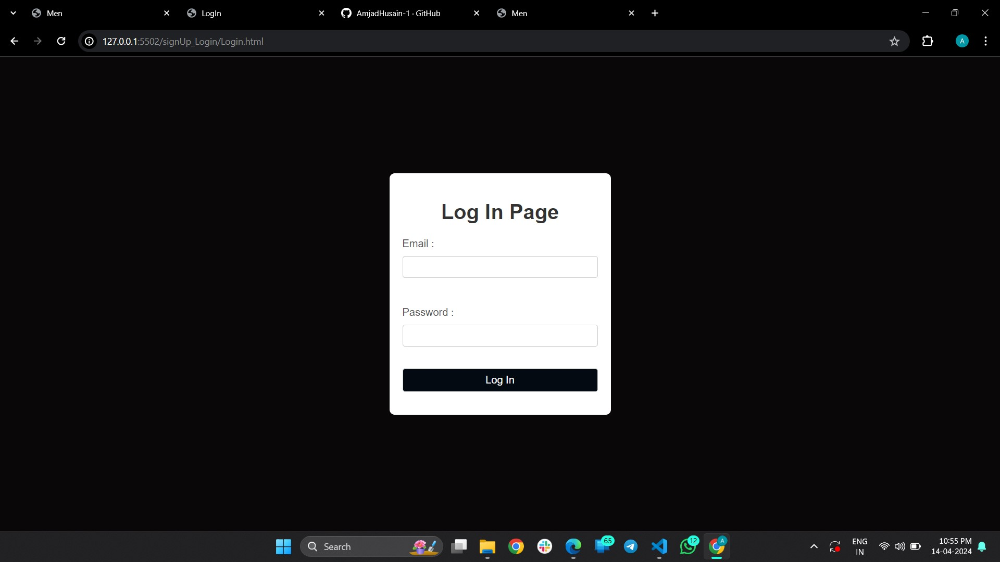
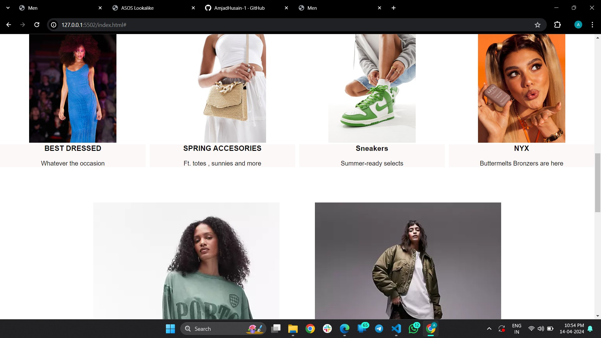
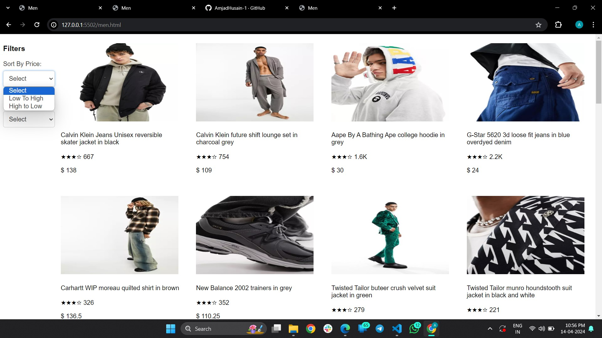
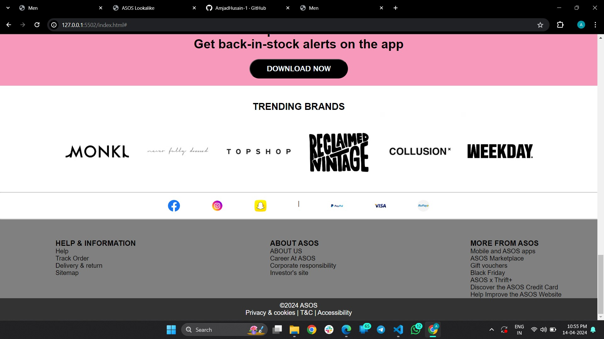

# ASOS

ASOS is a British online fashion and cosmetic retailer. The company was founded in 2000 in London, primarily aimed at young adults.

# ASOS CLone

This is the clone of ASOS which we i have done as a part of our project at Prepleaf. Its functional clone of the website. 

## Technologies used
-HTML
- Javascript
- CSS
- React
- Json Data

## Functional things

- User signup page 
- login page with form validation and data managed with  json server
- Home page
- 2 product pages with data managed with json server
- Sorting and Filtering functionality


## Run Locally

Pre-Requisite : 
VS Code

Clone the project

```bash
#   
```


## Website Flow

- Signup and Login pages 


- Homepage, Men & Women 


- Product pages 


- Footer



## Author

- [Amjad] (https://github.com/AmjadHusain-1)
